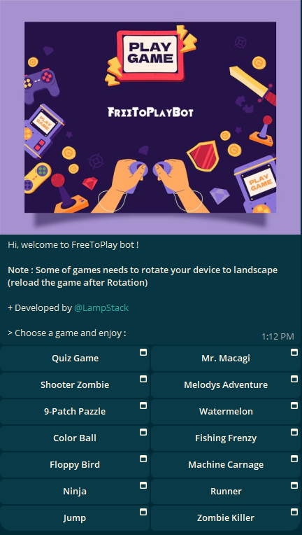

# Telegram Mini-App Multi Game Bot

Welcome to the Telegram Mini-App Multi Game Bot! This bot allows users to play multiple HTML5 games directly within Telegram.

## Preview

## Features

- Multiple HTML5 games
- Easy to use interface
- Seamless integration with Telegram
- Easy to add new games

## Usage

To start playing, simply click on the bot username below and follow the instructions:

[t.me/FreeToPlayBot](https://t.me/FreeToPlayBot)

## Source Code

[Click here to download free source code](https://t.me/osClub/87)

## Contributing

Contributions are welcome! Please create a pull request with your proposed changes and ensure they adhere to the coding standards of the project.

## License

This project is licensed under the MIT License. See the [LICENSE](LICENSE) file for more details.

## Contact

<a href="https://t.me/LampStack">Telegram</a> 
<a href="mailto:xialop@outlook.com">Email</a>
